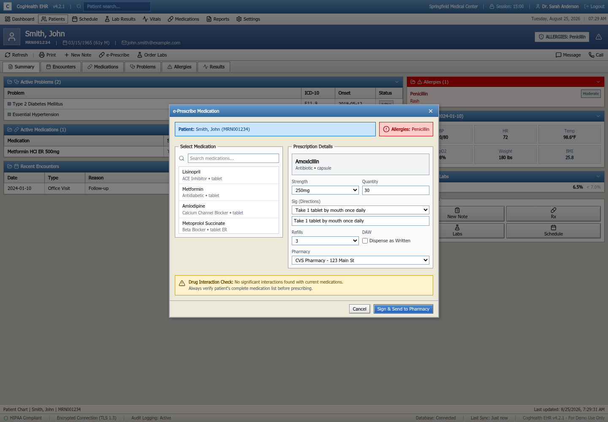

# UAT Results — CogHealth EHR Web

| | |
|---|---|
| Build under test | `demos-coghealth-ehr-web` @ `main` + branch `devin/1787641422-uat-e2e-suite` |
| Frontend | Vite dev server, `http://localhost:5173` |
| Backend | `demos-coghealth-ehr-api` replaced by a network-level mock (`tests/helpers/mockApi.ts`), 12 fixture patients |
| Harness | Puppeteer + Jest, headless Chrome, 1440x1000 |
| Command | `npm run test:e2e` |
| Result | **141 passed, 1 skipped, 0 failed** (91 new UAT scenarios + 51 pre-existing tests), 93s |
| Runs | Executed twice back-to-back with identical results (no flakes) |

Test code: `tests/uat.e2e.test.ts`, `tests/helpers/mockApi.ts`. Approved scope: `docs/uat/UAT_PLAN.md`.
Per-scenario screenshots are captured to `/home/ubuntu/uat-run/screenshots/UAT-<id>.png` at the end of every test.

## Verdict

Every UAT scenario in the approved plan is automated and green, but "green" includes ten scenarios that
assert the application's **current** behaviour where that behaviour is wrong. Those are listed below as
defects, not as passes of the intended behaviour. Nothing in `src/` was modified to make a test pass.

Gates: `npm run lint` clean, `npm run build` succeeds (only the pre-existing Browserslist age warning).

## Coverage by suite

| Suite | Scenarios | Result |
|---|---|---|
| UAT-1 Shell, navigation, session security | 9 (1 skipped) | 8 pass |
| UAT-2 Clinical cockpit / Dashboard | 13 | pass |
| UAT-3 Patient search & selection | 8 | pass |
| UAT-4 Patient chart | 11 | pass |
| UAT-5 e-Prescribing dialog | 6 | pass |
| UAT-6 Orders dialog (labs & imaging) | 4 | pass |
| UAT-7 Schedule | 8 | pass |
| UAT-8 Medications management | 5 | pass |
| UAT-9 Lab results | 4 | pass |
| UAT-10 Vitals / flowsheet | 9 | pass |
| UAT-11 Reports | 5 | pass |
| UAT-12 Settings | 6 | pass |
| UAT-13 Modal/dialog contract | 3 | pass |

Scenarios beyond the approved plan, added where the code exposed behaviour worth locking down:
`UAT-2.11` dashboard Refresh feedback, `UAT-2.12` patient-less New Note/Referral guidance,
`UAT-2.13` Mark All Read, `UAT-4.10`/`UAT-4.11` chart-to-search navigation and patient-identity retention
across tabs, `UAT-7.8` "Today" resets the schedule date, `UAT-10.6`–`UAT-10.9` Record Vitals entry dialog,
`UAT-11.5` all four report categories render.

### Not executed

**UAT-1.6 — session timeout warning and expiry dialogs (skipped).** The countdown in `src/App.tsx` is a
1-second `setInterval` over a 15-minute budget with the warning at 2:00 remaining; driving it needs a
`page.evaluateOnNewDocument` timer shim. Rather than ship a slow or flaky test, this is skipped and
documented in the source. It is the one HIPAA automatic-logoff path (45 CFR § 164.312(a)(2)(iii)) with no
automated proof — recommend the timer shim as the next increment. UAT-1.5 does cover the live countdown
and its reset on user activity against the real timer.

## Defects found

Severity is my assessment for a demo build; ordering is by clinical risk.

### D1 — Clinical decision support is hardcoded, so allergy conflicts are never flagged (High)

`src/components/ui/PrescriptionDialog.tsx` renders a fixed banner:
`Drug Interaction Check: No significant interactions found with current medications.` There is no logic
comparing the selected drug against `patientAllergies` or the active medication list. Prescribing
**Amoxicillin** (a beta-lactam) to a patient with a documented **Penicillin** allergy produces no warning —
the dialog reassures the prescriber instead.

Covered by `UAT-4.4` and `UAT-5.6`, which assert the hardcoded text so a future fix breaks them loudly.

### D2 — Five of six patient-chart tabs are unimplemented placeholders (High for demo scope)

Encounters, Medications, Problems, Allergies and Results each render `<Tab> view - Coming soon`; only
Summary has content. The Summary panels do show problems, medications, allergies, vitals and labs, so the
data exists — the tabs do not surface it. `UAT-4.3`.

### D3 — Failed patient lookup leaves the chart stuck on "Loading patient..." (High)

`PatientChartPage` sets `loading` false in `finally` but returns the loading view whenever `patient` is
null, so a 404 (`/patients/99999`, working API) is indistinguishable from a slow load — no error, no retry,
no route out except the toolbar. `UAT-4.9`.

### D4 — Dashboard silently renders empty panels when the API fails (Medium)

`DashboardPage` catches the fetch error, logs to the console and leaves every panel empty: inbox, worklist,
unsigned notes, pending orders and critical alerts all show zero rows with no error surface. A clinician
cannot distinguish "no critical alerts" from "the alert feed is down". Note the contrast with
`PatientSearchPage`, which does raise "Failed to load patients from server." (`UAT-3.8`). `UAT-2.10`.

### D5 — Vitals date-range control has no effect (Medium)

`VitalsPage` holds `dateRange` state (24h/48h/7d/30d) but never filters the flowsheet by it; switching the
range leaves the identical reading set. `UAT-10.2`.

### D6 — Record Vitals "Save" discards the entry (Medium)

The Save handler only closes the dialog (`onClick={() => setShowAddVitals(false)}`); entered values are not
added to the flowsheet or sent anywhere. `UAT-10.4`.

### D7 — Settings changes are not audited (Medium, HIPAA)

`SettingsPage` persists to `localStorage` but never calls `logAuditEvent`, so the `SETTINGS_CHANGE` event
type declared in `src/services/auditService.ts` is never emitted. Login/logout (`UAT-1.4`) and PHI access
(`UAT-4.2`) are audited correctly, so this is a gap in an otherwise working control. `UAT-12.6`.

### D8 — Cancelling the prescription dialog does not clear the form (Low)

`PrescriptionDialog` resets its state on successful submit but not on cancel, so cancelling after selecting
Amoxicillin and reopening presents Amoxicillin still selected — a wrong-drug risk on the next prescription.
`UAT-13.2`.

### D9 — No catch-all route (Low)

`src/App.tsx` defines no `*` route, so `/not-a-real-route` renders the shell with an empty content area
rather than a 404. `UAT-1.9`.

## What the suite proves, in contrast to the pre-existing tests

The pre-existing `tests/e2e.test.ts` mostly asserts that a page loaded or that a click did not throw, and
its patient-chart block self-skips when no backend is present. The new suite asserts outcomes against
deterministic fixtures, for example:

- exact row counts and row contents after filtering (12 patients → the 6 active female self-pay patients,
  by name, via the advanced filter panel — `UAT-3.2`)
- sort direction actually reversing, asserted as `descending === [...ascending].reverse()` (`UAT-2.5`)
- lab summary counts of `13 Abnormal` / `4 Critical`; collapsing the BMP panel removes its 8 component rows
  (11 rendered rows → 3) and re-expanding restores them, and patient filtering changes the rendered set
  (MRN001234 with CBC expanded → 13 rows; MRN001235 with Lipid Panel + A1c → 5) (`UAT-9.1`–`UAT-9.3`)
- audit-log contents in `localStorage.coghealth_audit_log`: `LOGOUT` on confirmed logout, `PATIENT_ACCESS`
  with the patient id on chart open (`UAT-1.4`, `UAT-4.2`)
- settings surviving a full page reload, driven through the UI rather than seeded storage (`UAT-12.2`–`UAT-12.4`)
- the modal contract on all four close paths including backdrop click, plus no scroll-lock or overlay leak
  after close (`UAT-13.1`, `UAT-13.3`)
- the API-down paths, exercised by flipping the mock to 500 mid-suite (`UAT-2.10`, `UAT-3.8`)

## Manual walkthrough (video proof run)

The suite was re-driven by hand in a maximized headful Chrome session against the same network-level mock,
to produce the recorded walkthrough. Every defect above was reproduced live in the UI except **D4**
(the mock stayed healthy for the whole run) and **D7** (a `localStorage.coghealth_audit_log` assertion with
no UI surface). No behaviour was observed that contradicts the defect list. 21 functional checks passed,
including the dashboard inbox preconditions (`4 unread`; `All (4) Results (2) Messages (1) Rx Refills (1)`;
`CRITICAL ALERTS (3)`), the search narrowing to 6 patients, the STAT lab order confirming
"2 test(s) ordered for Smith, John.", and Settings surviving a full reload.

## Recommendations

1. Fix D1 first — it is the only defect that could produce patient harm rather than user friction, and the
   data needed for a real check (`patientAllergies`, the active medication list) is already passed in.
2. D3 and D4 are the same root cause: fetch failures are logged, never rendered. One error-state
   convention across `DashboardPage`, `PatientChartPage` and `PatientSearchPage` closes both.
3. Add the timer shim so UAT-1.6 stops being the one uncovered HIPAA safeguard.
4. Keep `npm run test:e2e` out of CI as it is today (CI runs `--testPathIgnorePatterns=e2e`); it needs a dev
   server. If it should gate merges, add a workflow step that boots Vite and runs the suite against the mock
   API — no database required, which is why the mock was chosen over standing up Neon.
